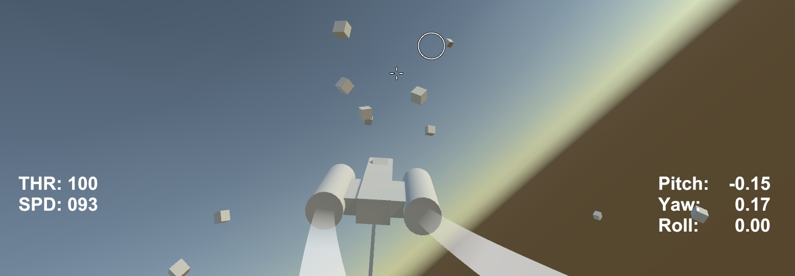
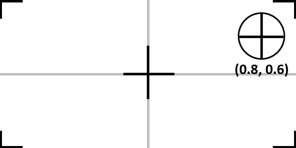
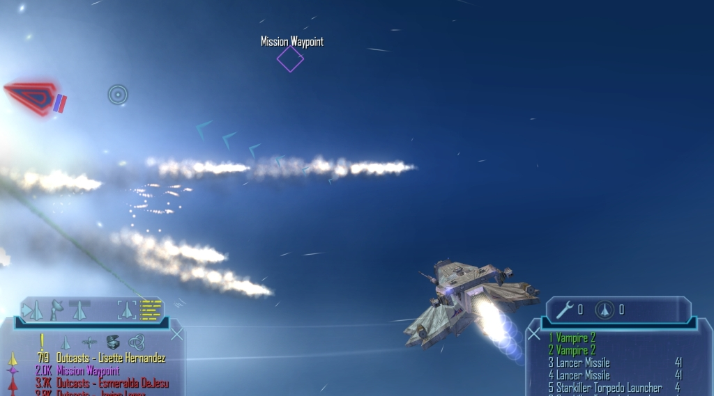
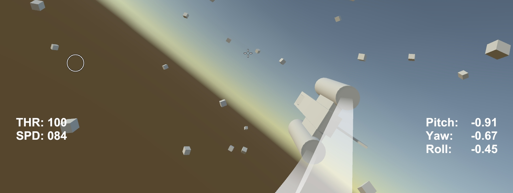

# FreelancerFlightExample
This project is an example of Freelancer style mouse controls. One of the most notable things about the game was that it practically "solved" the problem of playing space games with a mouse and keyboard. While setting up a virtual joystick [as seen in my other space flight example](https://github.com/brihernandez/ArcadeSpaceFlightExample), isn't too difficult, Freelancer used a fundamentally different solution. Its end results are *mostly* the same, but there are a lot of subtle nuances (arguably good and bad) to the way Freelancer controlled.

This project was built in **Unity 2017.3.1f1**.

## Download
You can either clone the repository or [download the asset package](https://github.com/brihernandez/FreelancerFlightExample/raw/master/FreelancerFlightExample.unitypackage) located in the root.

## Demo Controls

Use the mouse to fly the ship around. Use the keyboard to control the throttle and strafe.

- Mouse wheel: Speed up/down
- W/S: Speed up/down
- A/D: Strafe left/right

# How to Use
As this is more of a demo/example than an asset, I won't be describing how to apply this to standalone projects. However, as this is built off of [the ArcadeSpaceFlightExample project](https://github.com/brihernandez/ArcadeSpaceFlightExample), it's still a fairly straightforward architecture and set of prefabs. 

1. Load the `Flight` scene. You will see the ship and two camera rigs.
2. By default the `ComplexCameraRig` prefab is enabled. This is the prefab with the juicy camera motions.
3. If you wish to mess around with the simple rig, disable the `ComplexCameraRig` and enable the `SimpleCameraRig` in the scene.
4. Fly the ship using the controls described above!

## Camera Rigs
There are two camera rigs included. The `SimpleCameraRig` contains the camera code necessary to make this whole system work. As described below, the camera must follow the ship in a specific way in order for the banking to work correctly. 

The `ComplexCameraRig` includes extra code to mimic the camera motion of Freelancer. The code in this rig is based off of the camera code I wrote for the [Freelancer Flight Simulator](https://www.youtube.com/watch?v=8-e403xdxgU) project. This is not necessary for the demo, but it's a fun camera that I think is worth including.

# Mechanics
While on the surface this appears to be a virtual joystick type control scheme, it's actually more akin to an autopilot. Similar to [the Mouse Flight project](https://github.com/brihernandez/MouseFlight) the player does not directly control the ship. Instead, the player tells the ship where to go, and the ship then flies towards that point.

## Virtual Joystick
This is **not** how this example works, but it's a useful to contrast the difference.

The typical approach for this method is to take the mouse position on the screen, then translate it into normalized values meant to emulate a joystick. In the above example, the mouse cursor is up and to the right, which translates to joystick input of 0.8 yaw right, and 0.6 pitch up. Many games use this method as it is simple, consistent, and reliable.

## The "Turn Towards" Autopilot
*Disclaimer: I do not have access to the Freelancer source code, so the following is speculation based on my experience.*

Freelancer does something quite different. While on the surface it appears to use a virtual joystick (and for years I believed this was the case) it is instead a fly by wire "turn towards" system very similar to [the Mouse Flight project](https://github.com/brihernandez/MouseFlight) project.

Instead of using the mouse as direct joystick-like input, the mouse points at somewhere off in the distance and the ship then automatically turns toward that point. The camera being stuck behind the ship is why it appears to work like a virtual joystick. As long as you hold the mouse to the left of the screen, the ship will continually turn left because the "go to point" is perpetually to the ship's left.

This two channel autopilot takes care of the pitch and yaw. The roll channel is taken care of by the banking.

## Banking

The banking is a specific behavior worth talking about separately. When the ship is turning, it will bank (i.e. roll) in that direction by some pre-determined amount. What the banking really is though, is the roll component of the autopilot.

To achieve that cinematic banking, the ship is always rolling to match the camera's own up. This is why it's critical that the camera operates a certain way. The camera must inherit the pitch and yaw movements of the ship, but **not** the roll, as the ship must be able to roll independently of the camera. See the camera code in the `SimpleCameraRig` class for more information.

To figure out how much to roll, the mouse on the screen is used. When the mouse is on the rightmost edge of the screen, the ship will try to roll `bankLimit` degrees to the right, relative to the camera's up. See the `BankShipRelativeToUpVector` function in the `ShipInput` class for more details.

# Changelog

### 1.0 (Feb 9 2019)

- Released
